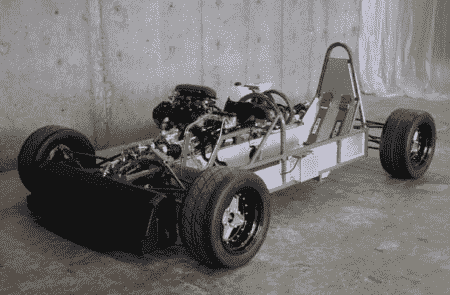

# 摩托车发动机驱动的汽车

> 原文：<https://hackaday.com/2008/07/06/motorcycle-engine-powered-cars/>

Autoblog 最近[发布了](http://www.autoblog.com/2008/07/06/lusomotors-lm23-150hp-honda-cbr-powered-track-car/)关于 [LusoMotors LM23](http://www.lusomotors.com/) 的消息，这是一款由本田 CBR1000 驱动的轨道车，重量不到 900 磅。我们知道已经有相当多的其他自制汽车放弃了传统的摩托车动力装置发动机，所以我们向谷歌询问了一些项目建议。它在 Kneeslider 旁边翻出了这张[摩托车动力汽车](http://thekneeslider.com/motorcycle-powered-cars/)的精彩合集。常见的[卡特汉姆怀疑](http://www.super7cars.com/Super7_GSX1300R_Hayabusa.html)出现了，但还有许多其他独特的车辆:从迷你和菲亚特转换到上图中的 [DP1](http://www.dpcars.net/) 独特的侧置发动机。一定要看看这个优秀的集合。

*   [永久链接](http://thekneeslider.com/motorcycle-powered-cars/)