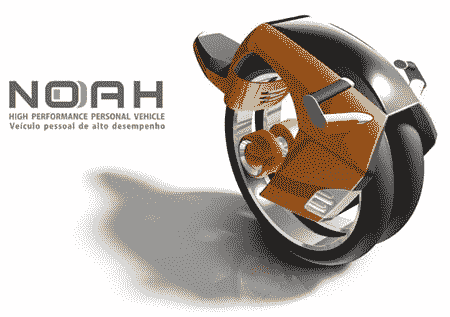
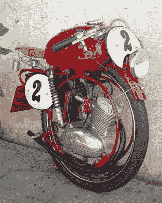
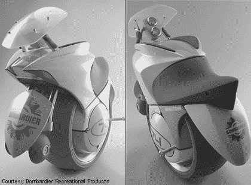
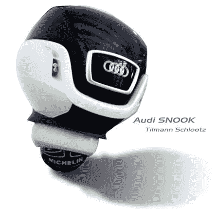
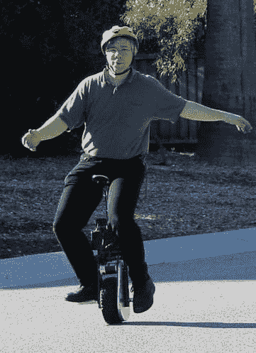
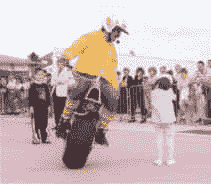
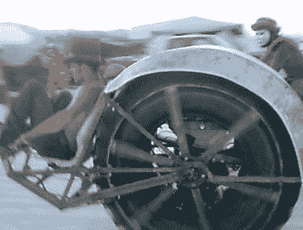
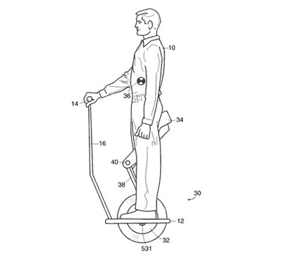

# 机动独轮车

> 原文：<https://hackaday.com/2008/07/10/motorized-unicycles/>

赛格威(Segway)可能是一个技术奇迹，但机动平衡运输已经存在了一段时间。我们收集了一些我们最喜欢的电动独轮车，让你享受刮膝盖的乐趣。

上面的设计让我们立刻想到了【本·古拉克】最近的一个奇迹，这个奇迹为他赢得了科普的[封面。奇怪的是，当读到[本]时，我们没有看到任何提到](http://www.popsci.com/scitech/article/2008-05/zero-emissions-one-wheeled-motorcycle?page=3)[诺亚](http://www.thedesignblog.org/entry/noah-bike-and-riders-unison/)。它由巴西的[ [Andre Franca](http://www.coroflot.com/public/individual_file.asp?portfolio_id=1227977&individual_id=188999&sort_by=1&c=1&) 设计，在 2007 年的 Plascar 汽车设计大赛中获得第二名。这些设计极其相似。

【scheerti】在 [S-blog](http://scheerti.blog.hu/2007/03/20/egykereken_mindenhova) 上发布了上述神秘奇观。这是匈牙利语，所以我们只能在悬念中生活，直到有人帮助我们翻译。

庞巴迪，许多受欢迎的休闲车的制造商，[不久前发布了一项设计](http://www.forbes.com/2003/11/04/cx_dl_1104vow.html)。不幸的是，他们表示可能永远不会生产。它有一个独特的停车“起落架”系统。你可以在上面左边的照片中看到它在前面的挡泥板下。EMBRIO 是一次设计实践，展示了庞巴迪对 2025 年休闲车的设想。

为了不被冷落，奥迪展示了[独特的设计](http://www.tuvie.com/audi-snook-futuristic-car-concept)。由[Tilmann Schlootz]设计，这一获奖设计结合了球形车轮和多方向传动系统。那就意味着这个坏男孩可以在面向任何方向的同时，走向任何方向。检查一下座位，它可以从一个座位平稳地转换成两个座位。想象一下，帮助你的约会对象在镇上度过一个夜晚。

如果那些对你来说太狂野或太快，为什么不试试一些更传统的型号。上图是[特雷弗·布莱克威尔]的[电动独轮车](http://www.tlb.org/eunicycle.html)，听起来几乎一模一样。还有 [enicycle](http://enicycle.com/) 和 [Einrad-Fahrzeug](http://fhznet.fh-bielefeld.de/fb2/labor-le/le3einrad.html) 。

For a more rugged application,look at [Le Monorue](http://www.jackiechabanais.com/le_monoroue.htm). It was designed by [Jackie Chabanais] who has also created a ton of other single wheeled vehicles.Out on the fringe, you will find [the Riot Wheel](http://www.theriotwheel.com/) . Different from any other single wheel design out there, it defies classification. Built for a trip to [Burning Man](http://www.burningman.com/), it gained instant publicity and has since been [featured](http://www.theriotwheel.com/MonsterNation.html) on Discovery Channel’s Monster Nation. While we’re talking about different ones, check out [Leviskate](http://www.electricunicycle.com/). You stand on it like a skateboard… or at least try.

让我们不要忘记老好人，赛格威的发明者。他也为单轮版本申请了专利。不像赛格威，这款车配有座椅！