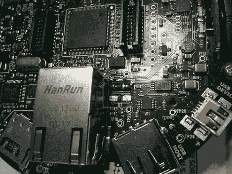
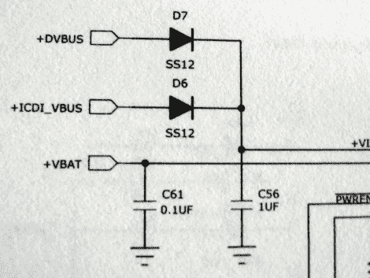
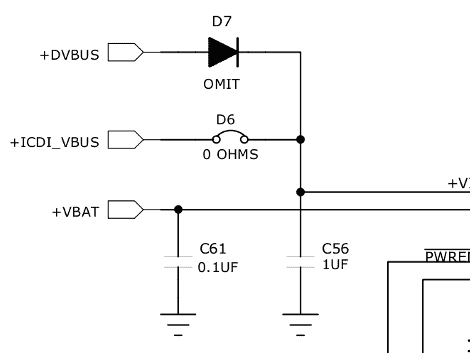

# 编程时移动 EvalBot 电源的电阻

> 原文：<https://hackaday.com/2010/11/11/moving-a-resistor-for-evalbot-power-when-programming/>



[赖利·波特]贴了一张他的 EvalBot USB 电源黑客的照片。在上面的照片中，我们在 D6 和 D7 周围放了一个方框。开发板在 D7 位置配有一个 0 欧姆电阻，从标有 USB 设备的 USB-B 连接器接入电源。他发现，通过将电阻移到 D6，他可以从标有 ICDI 的 USB-B 连接器给电路板供电。

该连接器是在线调试接口。TI 给了我们一个 EvalBot 包，所以我们拿出来自己试了一下。如果您插入 ICDI，它不会给主板供电，也没有 USB 设备注册。短接 D6 焊盘会改变该寄存器和以下 USB 设备寄存器:

```
Bus 002 Device 062: ID 0403:bcd9 Future Technology Devices International, Ltd Stellaris Evaluation Board
```

因此，看起来您需要两个 USB 连接或使用电池，以便通过 USB 对电路板进行编程。EvalBot 套装附带的 uC/OS-III 精装书包括电路板原理图。我们看了一下，惊讶地发现它们显示两个焊盘上都安装了二极管。在线原理图的版本 A 已被更正，显示了 D6 上省略的二极管和 D7 上的 0 欧姆电阻。休息后，两个原理图的图像都包括在内。

如果能在这里安装一个选择器开关，让您在构建原型时有更多的灵活性，那就太好了。

来自 uC/OS-III 第 700 页的原理图:



Stellaris 机器人评估板原理图版本 A(此处提供[):](http://focus.ti.com/docs/toolsw/folders/print/ekb-ucos3-evm.html?DCMP=STELLARIS&#Technical Documents)

