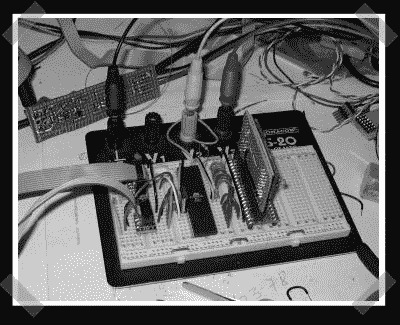

# Mp3 闪存恢复

> 原文：<https://hackaday.com/2006/11/16/mp3-flash-recovery/>

【巴特】派人去[恢复他在附近找到的一个神秘 mp3 播放器上的闪存数据](http://home.wanadoo.nl/b.bilos/projects/mysterymp3/mysterymp3.html)。他成功地使用 AVR/ATmega 设置构建了一个接口来访问数据。这可能是从损坏的拇指驱动器中恢复数据的可行方法——但将闪存芯片换到另一个驱动器上可能更容易。Chipquik 的东西听起来很有趣——低温 SMD 芯片脱焊。考虑到成本，我不确定与购买返工站相比，它的成本效益如何。

[如果你还没有，看看[黑客日设计挑战赛](http://www.hackaday.com/2006/11/15/hackaday-design-challenge-yes-a-contest/) [法比安的 nano](http://flickr.com/photos/fbz/298214406/) 是一个奖项，我会尽快宣布更多的奖项。]

*   [永久链接](http://home.wanadoo.nl/b.bilos/projects/mysterymp3/mysterymp3.html)