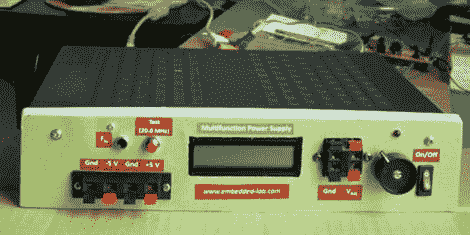

# 多功能台式电源

> 原文：<https://hackaday.com/2011/03/27/multi-function-bech-power-supply/>

关心项目的功耗，但又不想让电流表一直与电源串联？[Rajendra]感受到了您的痛苦，最近记录了他的问题解决方案:一个[可变输出台式电源](http://embedded-lab.com/blog/?p=1953)，它可以清楚地显示负载电流消耗以及其他信息！

一切都连接在一个漂亮宽敞的外壳中，它有一个 5V 和可变输出的前面板，一个调节电位计，甚至是一个集成频率计数器的输入。PIC16F689 MCU 运行显示，并在 16×2 字符 LCD 上显示可变的输出电压和电流。虽然显然有用，但 PIC 有足够的 I/o 和肌肉留给未来的扩展，电容计已经暗示为版本 2 的补充！

电源本身非常简单，使用 7805 和 7905 稳压器 IC 来提供 5V DC 输出。LM350 IC 还提供 1.25V 至 9V 之间的可变输出，限制为低于输入电压 3V，在这种情况下，来自标准变压器的整流 12V。

为了测量电流，在输出端串联一个低电阻的分流器。在大电流应用中，这些分流器通常由合金制成，在很宽的温度范围内保持相当一致的电阻。由于这个项目中的电流将被限制在几安培，所以不会有太多的电阻加热，一根 5 英尺长的 22AWG 电线缠绕成一个线圈提供了一个方便和低成本的替代方案。然后可以测量该电阻上的压降，根据欧姆定律，该压降与流经该电阻的电流成正比。与在这种情况下测量电压的调节器 IC 的输出相比，该电压降降低了提供给实际负载的电压，但在 lcd 上显示该值之前，该值已在代码中说明。

提供完整的源代码和原理图，并花大量时间解释一些更棘手的概念，如放大或降低信号幅度至适合 ADC 输入的水平，以及如何使用预分频器来计数超过 PICs 自带 20MHz 振荡器的高频。此外，虽然这种设计将电流检测能力限制在 1.2A，但我们讨论了运算放大器级的替代方案，它们可能会提高这一限制。

总的来说，这个项目对新手黑客来说应该是非常容易上手的，并且是练习许多基本电子概念的好方法。更好的是，最终结果是未来原型开发的有用工具。