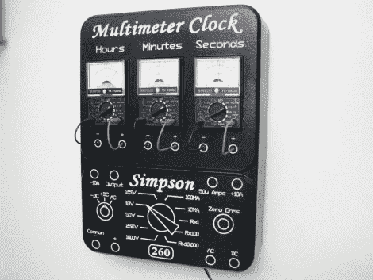

# 多万用表时钟

> 原文：<https://hackaday.com/2010/06/24/multi-multimeter-clock/>

[Alan Parekh] [将这个时钟做得看起来像一个万用表](http://hackedgadgets.com/2010/06/23/multimeter-clock-styled-after-the-simpson-260-multimeter/)，使用模拟万用表显示三个显示屏。PIC 负责计时，并向显示小时、分钟和秒钟的三个显示器提供特定的电流强度。

我们以前见过使用模拟仪表的[时钟。[Alan]将这个概念提升到了一个新的高度，替换了每个指针后面的刻度标记，以符合正确的显示。他还包括精确校准，使每一个米尽可能准确。在看了他的视频后，我们确信这是一个为广阔市场准备的精致产品，至少对那些欣赏显示器的极客因素的人来说。](http://hackaday.com/2010/01/30/hybrid-analogbinary-clock-the-mk2/)