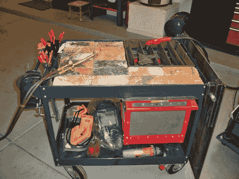

# 多用途焊接车

> 原文：<https://hackaday.com/2010/08/01/multi-purpose-welding-cart/>

[托德·哈里森] [组装一辆焊接车](http://www.toddfun.com/2010/07/20/multifunctional-diy-welding-cart/)，车内有各种各样的小把戏。这个骨架是一辆廉价的手推车，用钢板和更结实的车轮加固过。顶部托盘可以装载用于氧-乙炔焊接的耐火砖或用于切割的格栅。那个炉栅让炉渣穿过并进入下面的红边炉膛。最后，手推车右侧有一块钢板，它可以旋转并滑过装置顶部，为 MIG 焊接做准备。休息之后，托德在视频中向我们展示了他的多功能发明。这将很好地增强[你的其他焊接技能](http://hackaday.com/2010/04/23/flux-cored-to-mig-welder-conversion/)。

[https://www.youtube.com/embed/mR1cLIOf_Vc?version=3&rel=1&showsearch=0&showinfo=1&iv_load_policy=1&fs=1&hl=en-US&autohide=2&wmode=transparent](https://www.youtube.com/embed/mR1cLIOf_Vc?version=3&rel=1&showsearch=0&showinfo=1&iv_load_policy=1&fs=1&hl=en-US&autohide=2&wmode=transparent)