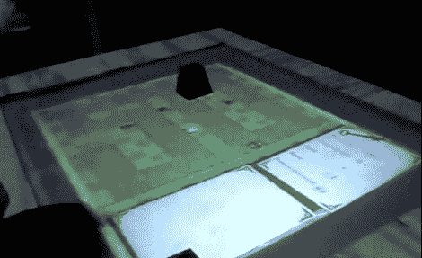

# 多触点塔式防御使用物理塔

> 原文：<https://hackaday.com/2011/08/31/multitouch-tower-defense-uses-physical-towers/>

如果你厌倦了用鼠标玩 flash 游戏，也许你会从这个项目中获得灵感。Arthur 构建了一个多点触摸界面，它使用对象作为控制方案的一部分。在上图中，你可以看到塔防游戏的游戏板显示在显示屏上。有一个平截头体形状的游戏片搁置在表面上。只要把那块放在你想要建造下一个塔的地方，然后从列表中选择塔的类型。

控制器本身非常简单。表面是一块丙烯酸树脂，上面涂有一些光漫射材料。一个投影仪通过设备侧面的另一个丙烯酸窗户照射进来，反射到 45 度角的镜子上。至于多点触摸检测，硬件使用一系列紫外发光二极管和一个经过修改的 PS3 眼睛摄像头。[Arthur]选择了[react vision 软件包](http://reactivision.sourceforge.net/)来处理来自摄像机的输入。休息之后，看看几个视频，看看硬件和一些游戏。

一看硬件:

[https://www.youtube.com/embed/T-5YXHaTRdQ?version=3&rel=1&showsearch=0&showinfo=1&iv_load_policy=1&fs=1&hl=en-US&autohide=2&wmode=transparent](https://www.youtube.com/embed/T-5YXHaTRdQ?version=3&rel=1&showsearch=0&showinfo=1&iv_load_policy=1&fs=1&hl=en-US&autohide=2&wmode=transparent)

游戏玩法:

[https://www.youtube.com/embed/yC8bICQfcCw?version=3&rel=1&showsearch=0&showinfo=1&iv_load_policy=1&fs=1&hl=en-US&autohide=2&wmode=transparent](https://www.youtube.com/embed/yC8bICQfcCw?version=3&rel=1&showsearch=0&showinfo=1&iv_load_policy=1&fs=1&hl=en-US&autohide=2&wmode=transparent)