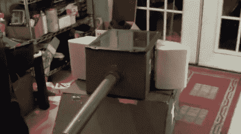

# 音乐坦克把吊杆放在音箱里

> 原文：<https://hackaday.com/2011/05/27/music-tank-puts-the-boom-in-boombox/>

当你想到阵亡将士纪念日周末，你会想到什么？在这里，我们所能想到的就是这个由指令用户(Elian_gonzalez)组装的坦克和音箱。

这个版本实际上是他的音乐坦克的第三个版本，它对以前的模型进行了各种改进。这个水箱主要是用胶合板建造的，里面有洞穴状的隔间，用来存放所有的好东西。在其宽敞的车身中，坦克配备了 60 瓦的立体声系统，为安装在炮塔两侧的一对外部扬声器提供动力。炮塔本身包含一个由 PVC 管制成的气动加农炮，我们想象它可以用来发射大量不同的射弹。

虽然这个概念本身很酷，但这种坦克碰巧也能自给自足。该坦克有一个非常深的电池槽，并使用 50w 自制太阳能电池板来帮助保持使用时的状态。[Elian]没有详细说明总的运行时间，但是我们想象在一个晴朗的日子里，它可以运行几个小时。

请继续阅读，观看音乐坦克 MK3 的长视频演示。

[https://www.youtube.com/embed/_1Rrjm9JhXQ?version=3&rel=1&showsearch=0&showinfo=1&iv_load_policy=1&fs=1&hl=en-US&autohide=2&wmode=transparent](https://www.youtube.com/embed/_1Rrjm9JhXQ?version=3&rel=1&showsearch=0&showinfo=1&iv_load_policy=1&fs=1&hl=en-US&autohide=2&wmode=transparent)