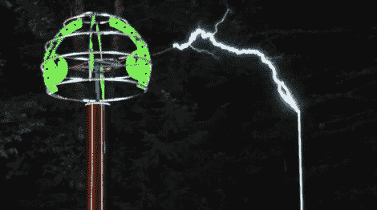

# 音乐特斯拉音乐会是电气化

> 原文：<https://hackaday.com/2011/04/17/musical-tesla-concert-is-electrifying/>

Hackaday reader [Tyler Laseter]来信告诉我们，他和他的特斯拉管弦乐队队友下个月将举办一场活动。

[“Open Spark Project”是一场音乐会，将于 5 月 14 日](http://www.opensparkproject.com)举行，以壮观的方式将电和音乐融合在一起。这项活动的特点是两个大型特斯拉线圈，它们被调整为播放音符，同时在空中发射闪电。

音乐磁暴线圈在[不是什么新鲜事](http://hackaday.com/2008/06/12/singing-tesla-coils/)，但是我们还没有看到有人允许普通大众在他们的线圈上播放音乐。这就是这次活动的独特之处——鼓励任何人向特斯拉管弦乐队提交他们的作品，这些作品将在下个月通过现场视频流播放。他们的网站提供了所有的技术细节以及提交活动音乐的文件格式要求，所以今天就开始报名吧！

如果被动的方法更适合你，留下来看一个展示他们线圈能力的视频。当然是 Lady Gaga，但我们不会告诉任何人你看过。另外，当这首歌用 20，000 伏电压播放时，这是完全合法的。

[https://www.youtube.com/embed/NzLC1lVWDSk?version=3&rel=1&showsearch=0&showinfo=1&iv_load_policy=1&fs=1&hl=en-US&autohide=2&wmode=transparent](https://www.youtube.com/embed/NzLC1lVWDSk?version=3&rel=1&showsearch=0&showinfo=1&iv_load_policy=1&fs=1&hl=en-US&autohide=2&wmode=transparent)