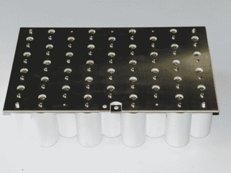

# 天哪，你的电容器组真大

> 原文：<https://hackaday.com/2010/07/18/my-what-a-large-capacitor-bank-you-have/>

[丹尼尔·埃因霍温]组装了这个[11344 焦耳的电容器组](http://www.megavolts.nl/en/projecten/geweren/160-condensator-bank-113kj-bij-350v)，他说这个电容器组非常适合武器，比如[轨道炮](http://hackaday.com/2010/01/01/making-a-rail-gun-again/)、[线圈炮](http://hackaday.com/2010/05/17/final-projects-wifi-coil-gun-turret/)，或者电热化学炮。他加工了几块铝板作为正负母线。两者被一块裸露的 PCB 板隔开(这让我们想知道[他是如何让铜像那样剥落的](http://www.megavolts.img/stories/projecten/condensatorbank11,3kj/constructie/CIMG2123.JPG))。一旦充好电，还有一个小问题就是如何在不被咬的情况下给系统放电，丹尼尔通过[建立一个气动开关](http://www.megavolts.nl/en/projecten/geweren/158-hoog-vermogen-pneumatische-schakelaar)解决了这个问题。我们并不觉得测试镜头很有趣，但我们确实在休息后嵌入了他的开关演示。

[https://www.youtube.com/embed/mCX0RQm0nsk?version=3&rel=1&showsearch=0&showinfo=1&iv_load_policy=1&fs=1&hl=en-US&autohide=2&wmode=transparent](https://www.youtube.com/embed/mCX0RQm0nsk?version=3&rel=1&showsearch=0&showinfo=1&iv_load_policy=1&fs=1&hl=en-US&autohide=2&wmode=transparent)

[感谢库尔特通过[被黑的小工具](http://hackedgadgets.com/2010/07/16/113-kilojoule-capacitor-bank/)