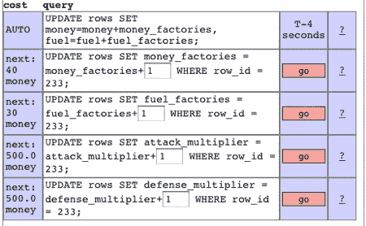

# MySQLgame，玩数据库查询

> 原文：<https://hackaday.com/2008/08/23/mysqlgame-playing-with-database-queries/>

[mySQLgame](http://mysqlgame.appspot.com/) 是一款古怪的[应用引擎](http://www.mahalo.com/Google_App_Engine)游戏，它决定放弃华丽的用户界面，只坚持系统的核心:数据库。您可以通过在共享游戏数据库中创建自己的行来开始游戏。游戏时间每十秒增加你的燃料和金钱资源。燃料消耗在扫描其他行和攻击上。钱用于升级和建造单位。建立资源和攻击你的邻居使用数据库查询，就像任何其他游戏。想在你的网络游戏上加点光泽吗？看看拖钓模拟器 [Forumwarz](http://www.forumwarz.com/) 。

[via [蜡质](http://waxy.org/links)

*   [永久链接](http://mysqlgame.appspot.com/)