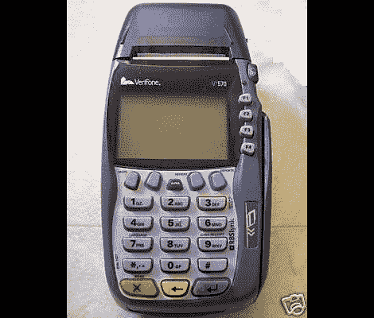

# 命名这些部分:Verifone 支付模块拆除

> 原文：<https://hackaday.com/2011/11/23/name-these-parts-verifone-payment-module-tear-down/>

[Jerzmacow]在跳蚤市场得到了这个 Verifone Vx570 手持支付终端。它有一台热敏打印机，一个磁卡阅读器，还有一个大液晶显示屏和按钮。换句话说，他黑客娱乐的很多部分。但首先，他决定[看一看设计](http://www.instructables.com/id/Verifone-Vx570-Payment-terminal-teardown/)中用到的部件。他小心翼翼地拆开这个装置，记录下他一路上发现的东西。他提到有一个开关压在 LCD 的下面，拆卸时会禁用硬件。因此，听起来他无法让它再次工作(里面有一个锂电池，我们猜测它为某种硬件断路开关电路供电)。

他上传了一段我们在休息后嵌入的高清视频。我们发现有些设计很奇特。通常情况下，我们会让[达夫·琼斯]在他的电子博客硬件评论中为我们介绍设计选择。由于[Jerzmacow]无法提供这种水平的洞察力，我们很想听听您对每件硬件的看法。留下您的评论，以及视频的时间戳。具体来说，1:51 显示的那个奇怪的板子是怎么回事？

[https://www.youtube.com/embed/PQEw0_73Q0M?version=3&rel=1&showsearch=0&showinfo=1&iv_load_policy=1&fs=1&hl=en-US&autohide=2&wmode=transparent](https://www.youtube.com/embed/PQEw0_73Q0M?version=3&rel=1&showsearch=0&showinfo=1&iv_load_policy=1&fs=1&hl=en-US&autohide=2&wmode=transparent)