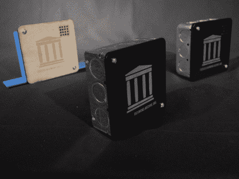

# 需要便宜和丰富的项目箱？去你当地的五金店

> 原文：<https://hackaday.com/2011/08/05/need-cheap-and-plentiful-project-boxes-hit-up-your-local-hardware-store/>

真正使项目完整的一件事是你包装最终产品的方式。有些人可以接受一块向四面八方伸出电线的原板，说实话，我们也一样——这取决于具体的应用。

[丹尼尔]在 archive.org[寻找外壳](http://blog.archive.org/2011/08/05/open-hardware-inexpensive-enclosures-from-junction-boxes/)来包装他正在研究的一些湿度和温度监视器。他突然意识到，电气接线盒便宜，随处可得，非常适合这项工作。他去五金店买了几个不同的箱子，然后在投入使用前花了些时间把它们清理干净。

虽然他无法将 PVC 塑料盖子放入他的激光切割机，但他确实在商店买了一些桦木胶合板，这很好地满足了他的需求。经过几分钟的切割和几层油漆后，他的项目箱有了一些很棒的封面。他在金属外壳的内部添加了一块板层来保护他的组件，当一切完成时，他对结果非常满意。

假设你手头没有激光切割机。塑料盒在大多数情况下都很好，但如果你绝对需要金属外壳，在所有内表面涂几层塑料也能保证电子产品的安全。

现在，没有人认为电子项目中接线盒的使用是革命性的。它只是五金店里那些你可以盲目地经过无数次而不会多看一眼的商品之一，直到有人碰巧指出它们可以做一个完美的外壳。这是我们可以欣赏的。

如果你有兴趣把自己的一些放在一起，[丹尼尔]已经把他的激光切割机模板[放到网上](http://danreetz.com/IA/IA_Open_Hardware_Enclosures.zip)。