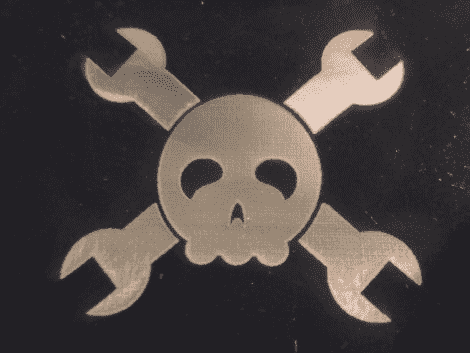

# 负激光蚀刻

> 原文：<https://hackaday.com/2010/08/17/negative-laser-etching/>

[詹姆斯]一直在完善一种用激光负蚀刻金属的方法[。他一直在使用一种名为 Thermark 的产品，这是专为这一过程设计的，但它非常昂贵。他发现为柴炉设计的涂料也同样有效。为了准备表面，他对珠子进行喷砂处理，然后用丙酮清除残留物和指纹。在用喷漆覆盖木板之前，先在炉子里预热。他以 0.1 毫米的步长以 98/100 的功率和 90/400 的速度运行激光器，以获得上述结果。这应该会立即让你想到](http://www.redtorope.com/2010/08/negatively-laser-etched-metal/)[制造电路板](http://hackaday.com/2008/08/03/laser-etching-printed-circuit-boards/)。我们很想放弃墨粉转移，我们总是在寻找更多的理由获得激光切割机。