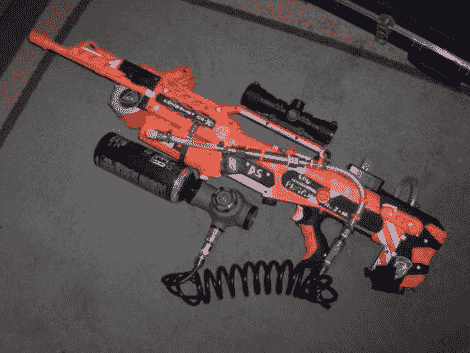

# Nerf 枪转换为 CO2 半自动枪

> 原文：<https://hackaday.com/2010/12/03/nerf-gun-converted-to-co2-powered-semi-automatic/>

改装了一把 Nerf 步枪，由于压缩空气的力量，使其成为半自动步枪。这不是一个简单的改变，取决于他设计和制造枪栓动作的能力，适合枪，与 Nerf 弹药一起工作，并使用 CO2 罐和电磁阀进行发射动作。知道了这一点，发现他是石溪大学的工程系学生就不足为奇了。他开始用一些聚甲醛，或[聚甲醛塑料](http://en.wikipedia.org/wiki/Polyoxymethylene_plastic)以商标名 Delrin 出售，并使用数控车床加工螺栓零件。添加一些黄铜配件，一个螺线管，管道和电子设备，你就可以开始工作了。

休息之后我们嵌入了测试片段。看起来新的内部允许相当快的射速(也许每秒 2-3 发？)并达到 70 到 100 英尺之间的距离。

[https://www.youtube.com/embed/NwA4CqpO7nI?version=3&rel=1&showsearch=0&showinfo=1&iv_load_policy=1&fs=1&hl=en-US&autohide=2&wmode=transparent](https://www.youtube.com/embed/NwA4CqpO7nI?version=3&rel=1&showsearch=0&showinfo=1&iv_load_policy=1&fs=1&hl=en-US&autohide=2&wmode=transparent)