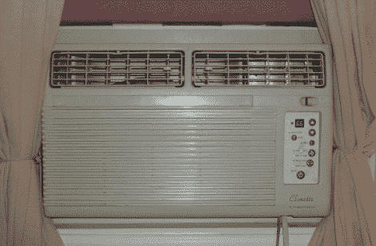

# 网络使能窗式空调

> 原文：<https://hackaday.com/2010/08/04/network-enabled-window-air-conditioner/>

众所周知，美国中部现在感觉像一个非常潮湿的烤箱。如果你正在应对三位数的气温，window AC hack 可能会帮你一把。他在上面的单元上增加了网络连接，但是图片有点骗人。进入底部的蓝色 CAT-5 电缆并不直接连接到网络，而是将该单元的向上和向下按钮连接延伸到外部中继板。在那里，他使用 SNMP 板将其连接到网络，并使用 PHP 命令来重置温度。该单元具有 66-88 华氏度的工作范围，因此他循环足够的按钮按压以达到最大或最小水平，然后设置期望的温度(避免需要知道该单元当前设置在什么温度)。

如果你有一个带遥控器的空调，你总是可以使用红外设备接入系统来实现类似的功能。