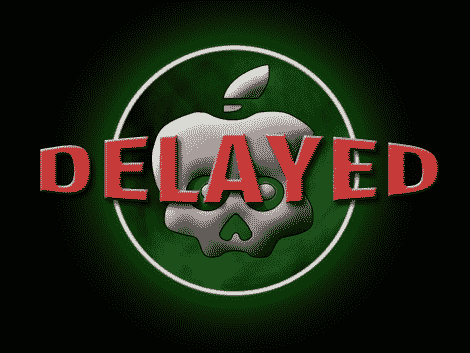

# 新的 A4 越狱灾难为 IPad 踩下刹车

> 原文：<https://hackaday.com/2010/10/10/new-a4-jailbreak-debacle-puts-the-brakes-on-for-ipad/>

如果你一直在等待下一次越狱的发布，你应该知道有一点减速。[ChronicDevTeam]一直致力于为基于 A4 的 iOS 设备开发一个名为 SHAtter 的漏洞，[上周四](http://twitter.com/#!/chronicdevteam/status/26682936459)发推文称，经过全面测试、无捆绑、不可修补的软件包(称为 [greenpois0n](http://greenpois0n.com/) )将于今天发布。但是上周五[Geohot]，你可能还记得《T4》中的 PlayStation 3 虚拟机管理程序漏洞，推出了他自己的几乎未经测试且公认为测试版的越狱，名为[limera 1n](http://limera1n.com/)。

那么，情况会如何呢？因为[geohot]使用了不同的漏洞，所以[ChronicDevTeam]决定不发布 greenp0ison。如果他们这样做了，这将给苹果一个机会来阻止两种不同的利用。相反，他们正狂热地使用 limera1n 的相同漏洞进行整合、测试和重新打包。

如果你不想等待，现在越狱，但你的风险与一个不稳定的利用方法，只有 Windows 可用的问题。

[via [@ChronicDevTeam](http://twitter.com/#!/chronicdevteam)