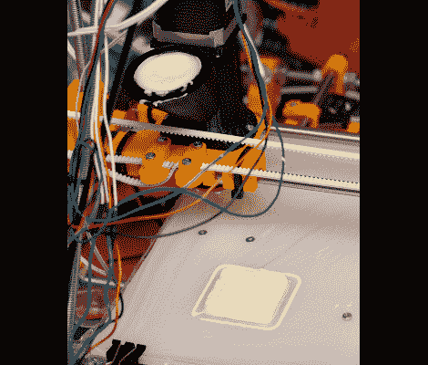

# 新型挤压机 3D 打印美味的巧克力

> 原文：<https://hackaday.com/2012/02/29/new-extruder-3d-prints-tasty-treats-using-chocolate/>

如果你手里拿着一个裱花袋从未有过家的感觉，这款巧克力挤压机将会拯救你。它可以取代你的 3D 打印机(RepRap，Makerbot，大多数 3 轴数控机床等)上的塑料挤出机头。)，让你把你的数字创作变成颓废的现实。

头部使用[一个渐进腔泵](http://en.wikipedia.org/wiki/Progressive_cavity_pump)将巧克力从一个容器通过打印喷嘴输送出去。保持巧克力的温度很重要，否则它会凝固，所以当[孙铁麟·萨洛]设计打印头时，他包括了一个隔热罩，热空气可以通过它循环。他用一个烘鞋器来烘干热头发，然后用一根管子把热头发缝进隔热罩里。

这种挤出机可以 3D 打印，但要小心你用什么材料。[孙铁麟]提到 PLA 是“某种程度上的食品安全”,但 ABS 不是。我们想知道这种设计是否可以改变，以便铣削出铝或不锈钢？无论如何，如果你打算尝试一下，你可能会发现[孙铁麟的]关于巧克力的建议很有用。

[via [@clothbot](https://twitter.com/#!/clothbot/status/173067792772366336)