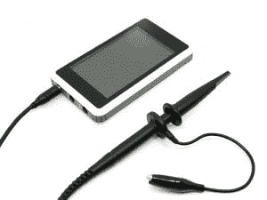

# 新的廉价 DSO 现已上市

> 原文：<https://hackaday.com/2011/04/12/new-inexpensive-dso-now-shipping/>

Seeed Studio 的黑客友好工具系列已经扩展了一个，他们宣布他们的 DSO 四路示波器的测试版现在可以发货了。DSO Quad 大约是一个厚 iPod 的大小，但具有令人印象深刻的功能，如两个 72MSPS 模拟通道和一个信号发生器。到目前为止，DSO Quad 最酷的“特性”是它完全开源。

[DSO Quad](http://www.seeedstudio.com/depot/preorder-dso-quad-beta-test-p-736.html?cPath=174) 是一款袖珍四通道数字示波器，专为“常见电子工程任务”而设计它基于 ARM Cortex M3，通过集成 FPGA 和高速 ADC 在两个通道上提供 72MSPS 模拟带宽。除了四个数据采集通道(两个模拟，两个数字)，DSO Quad 还有一个信号发生器。这使您可以输出 10Hz 到 1MHz 的方波、三角波、锯齿波和正弦波。内部 2MB 盘可用于存储采样数据、升级固件或运行定制程序。由于该设备仍处于测试阶段，一些软件规格还不确定，但如果你正在寻找一个相对便宜的范围，这可能是你的一个。请记住，对于这个预生产运行，你不会得到任何文件，所以要做好离开保留区和依靠自己的准备。