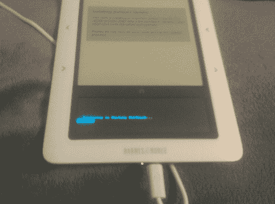

# 新的 Nook 说:没有你的根！

> 原文：<https://hackaday.com/2010/08/15/new-nook-says-no-root-for-you/>

这是一张巴恩斯&诺布尔 Nook 电子书阅读器陷入无限重启循环的模糊图像。这是试图将固件降级到 1.0 以准备[软根设备](http://hackaday.com/2009/12/23/nook-rooted-without-being-opened/)的结果。所以在几次失败后，设备会自动恢复，对吗？看起来不是那样。没问题，不就是把它弹开[把 OS 重新写到里面的 SD 卡上做个硬件 root](http://hackaday.com/2009/12/17/how-to-root-a-nook/) 吗？不，看起来最新的硬件版本已经用内存芯片取代了方便的 SD 卡。

现在它是一块砖头，但我们确信很快会有办法解决这个问题。一点焊料、一些电线和一个刷新应该与 EEPROM 恢复的工作方式差不多。也就是说，如果你有一个原始图像来处理。

所以现在，如果序列号以 1003 开头，小心不要尝试 root 你的 nook。

[谢谢肯]