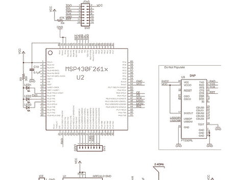

# 下一个希望徽章黑客入门

> 原文：<https://hackaday.com/2010/06/22/next-hope-badge-hacking-primer/>

[Travis Goodspeed]正在查看今年下一届 HOPE 会议的与会者徽章。他让我们很好地了解了棋盘上的内容，它对你意味着什么，以及你如何得到它。当然，最终的硬件规格是一个秘密，直到会议时间，但这将帮助您获得一些想法，并确保您带来正确的附加硬件。我们通常尽量不引用太多，但是[特拉维斯的]一句话确实让我们笑出声来(与大多数人描述的 lol 相反):

> “这些徽章是有源 RFID 标签，每秒钟可以指示每位与会者的位置几次，因此该死的谎言军团——我指的是下一个希望徽章委员会——可以跟踪宾夕法尼亚酒店周围的每位与会者。”

不管你对徽章委员会感觉如何，黑客会议徽章的传统是一个有趣的，有益的，而且经常令人沮丧的过去。徽章实际上使用了 OpenAMD 的概念。最后三个字母代表与会者元数据，这是一个不断发展的概念。关于参与者的元数据如何以一种非侵入性的方式对所有参与者有用？把自己和一个概念联系起来怎么样，比如微控制器编程。如果你能搜索到其他对此感兴趣的人现在在哪里，会怎么样？可能会很棒…可能会在没有好理由的情况下，在洗手间附近的临时会议中结束。无论哪种方式，休息之后，请观看涵盖该主题的预告视频。

哦，关于硬件还有一点要注意。今年，他们从基于 PIC 的徽章转移到更节能的 MSP430 系列。这不是 Launchpad 打算用于的价值线处理器之一，但如果你已经花了一些时间与‘G’系列一起工作，这个老大哥‘F’芯片将没有问题。