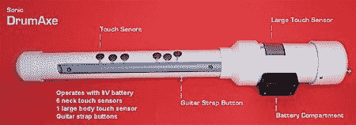
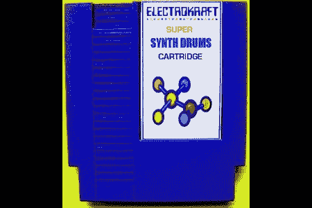

# 任天堂鼓槌控制器

> 原文：<https://hackaday.com/2008/06/20/nintendo-drumaxe-controller/>

<http://www.youtube.com/v/Bgkh00sHR5c>

  
我们已经不记得上一次发布 NES 的新车或外设是什么时候了，但 ElektroKraft 的[Tony Amendolare]刚刚改变了这一点。与 Nesdev.com 合作，【阿蒙多拉尔】创造了[超级合成鼓](http://electrokraft.com/index.html)，这是一种 NES 兼容的弹药筒，可以将 NES 游戏手柄上的按钮按键转换成由 NES 的声音芯片合成的鼓声。为了补充他的软件，他创造了 Sonic DrumAxe，这是一个控制器，看起来有点像土豆枪，演奏起来像吉他。

The Sonic DrumAxe controller uses a PIC microcontroller to drive a serial to parallel shift register. It has six touch sensors on the neck and one large one on the thick end. Unfortunately it requires custom inputs on the NES console, so it can’t be used with an unmodified NES.

【Amendolare】用 6502 汇编语言写的超级合成器鼓。他使用 NES 控制台将软件安装到手推车上，该控制台已经过修改，可以读写手推车上的数据。该软件可以用 DrumAxe 或标准控件来控制。[阿蒙多拉雷]也在一台克隆约博机器上完成了他的大部分演示，而且运行得非常完美。

如果你想加入 8 位电路弯曲的行列，ElectroKraft 正在以大约 49 美元的价格出售超级合成器鼓。这还不包括 Sonic DrumAxe，但[Amendolare]告诉我们，他将在今天晚些时候在易贝出售一整套产品——手推车、DrumAxe 和改装的 NES。我们会尽快给你链接；请记住，所有销售收入的一部分将捐给儿童医院和慈善机构，用于救助饥民。

更新:[Tony]刚刚给我们发了一个链接，链接到他在易贝拍卖的鼓斧套装。同样，这包括手推车，鼓斧，和改装的 NES。

【通[通【通】通](http://www.getlofi.com/?p=1089)

*   [永久链接](http://electrokraft.com/index.html)