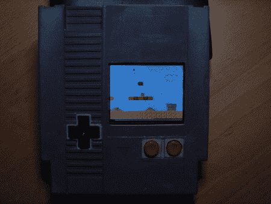

# 任天堂娱乐系统黑客

> 原文：<https://hackaday.com/2008/07/30/nintendo-entertainment-system-hacks/>

元过滤器有一个不错的[各种 NES 黑客的综述](http://www.metafilter.com/73657/Nintendo-Entertainment-System-Hacks)。你可能以前见过这些，但是在一个地方看到它们是很棒的。我们个人最喜欢的是装在 NES 弹夹里的[NES](http://www.joystiq.com/2008/07/04/handheld-nes-in-an-nes-cartridge/)，谁会忘记 [NES 控制器茶几](http://ultra-awesome.blogspot.com/2008/05/nes-coffee-table-final-post-rah.html)？别忘了查看更多[有趣](http://gizmodo.com/gadgets/pcs/mac-mini-nes-mod-157794.php) [NES](http://dailyrevolver.com/2008/06/25/firenes-firefox-nes-emulator-plugin/) [黑客](http://www.tripoint.org/kevtris/Projects/portendo/index.html)的评论。我们认为最初的任天堂娱乐系统激发了人们全力以赴的创造力和游戏性。我们敢打赌，你家里可能有一个积满灰尘的旧系统，正等着被修改和破解。我们很想知道你已经做了什么，或者将要做什么。

*   [永久链接](http://www.metafilter.com/73657/Nintendo-Entertainment-System-Hacks)