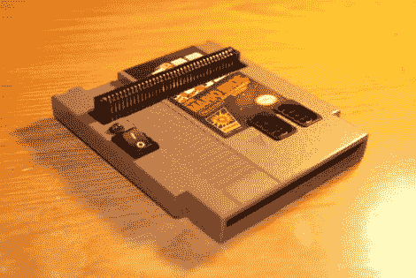

# 任天堂被黑进了 NES 的盒子里

> 原文：<https://hackaday.com/2011/03/28/nintendo-hacked-to-fit-inside-an-nes-cartridge/>

Instructables 用户[dany32412]最近制作了一台可以说是我们迄今为止见过的最小的 NES 游戏机。利用任天堂的芯片(NOAC)板，他制造了一个 [NES 系统，可以放入一个中空的 NES 盒](http://www.instructables.com/id/NES-in-a-Cartridge)。

他在当地一家二手商店购买了一套 NOAC 系统，并开始着手拆卸。由于大多数这些设备通常由内置于控制器中的游戏系统组成，并且额外增加了 Famicom 游戏插槽，他知道如果他要将其转换为与实际的 NES 游戏和控制器一起正常工作，他还有很多工作要做。

他黑掉了 NOAC 的大部分电路板，只留下了 CPU 和控制器接口芯片。然后，他构建了一个定制的控制器接口板，以便正确地将他的 NES 控制器的按钮映射到 NOAC 的面板上。他连接了一个 72 针的 NES 盒式磁带插槽，然后添加了一对控制器端口和一个电源开关。一旦他连接并测试了所有的东西，所有的东西都被保存在超级马里奥兄弟 NES 的弹夹里。

看看下面他的迷你 NES 的视频。

如果你不能得到足够的任天堂黑客，一定要看看这个[便携式 NES](http://hackaday.com/2011/03/24/portable-nes-console-gets-it-oh-so-right/) 以及这个[基于模拟器的盒式 NES](http://hackaday.com/2009/10/12/emulator-in-nes-cartridge-so-clean-it-looks-factory-made/)。

[https://www.youtube.com/embed/3yGzoNGbgIA?version=3&rel=1&showsearch=0&showinfo=1&iv_load_policy=1&fs=1&hl=en-US&autohide=2&wmode=transparent](https://www.youtube.com/embed/3yGzoNGbgIA?version=3&rel=1&showsearch=0&showinfo=1&iv_load_policy=1&fs=1&hl=en-US&autohide=2&wmode=transparent)