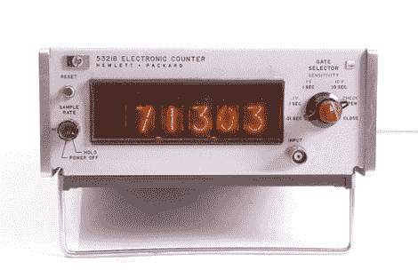

# 谢妮频率计数器走时表

> 原文：<https://hackaday.com/2010/11/12/nixie-frequency-counter-gone-timepiece/>

邪恶疯狂科学家实验室的[温德尔]用一个古老的数码管为基础的频率计数器[把它转换成一个时钟](http://www.evilmadscientist.com/article.php/nixieclocks)。他拿到的是一台惠普型号的机器，当时状态还很好。他使用内部产生的一秒脉冲作为时钟信号，但需要一些修改来显示时间。这是因为频率计数器的基数是 10，而时钟使用的基数是 60 和 12 的奇怪组合。

安装一个系统来跟踪分钟和秒钟并不是太大的问题。每一个十位数字都由他加入的几个与门监控。当它们检测到“6”时，该数字被复位，一个脉冲递增下一个数字作为进位。然而，这很难用几个小时来完成。分和秒从 0 到 59 计数，但小时不是从 0 开始。[温德尔]没有让逻辑过于复杂，而是使用了一点技巧。用于计时的谢妮电子管已经重新布线，因此当计数器处于 0 时，1 形状的灯丝就会亮起。逻辑上没有区别，只是翻译使它们显示的数字比实际数字高一位。