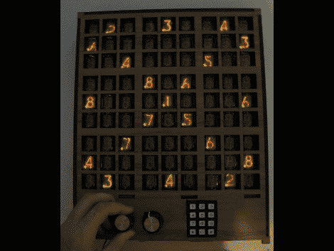

# 谢妮数独

> 原文：<https://hackaday.com/2010/07/09/nixie-sudoku/>

[John Sarik]问自己为什么一个项目应该只有少量的谢妮管？没有一个好的答案来回答他的问题，他继续前进，用 81 个谢妮电子管制作了这个数独游戏。对他的工作没有太多的描述，但我们认为事情是这样的:两个旋钮操纵光标，一个用于行，另一个用于列，而键盘用于输入你选择的数字。该系统基于 Arduino，并且[John 的]链接到他在 Dropbox 上的代码、原理图和电路板布局文件。他甚至写了一个递归解算器，休息后可以在视频中看到。把它带到工作中并在休息时间拿出来会不会不合适？

[https://www.youtube.com/embed/xdmOi67PPvs?version=3&rel=1&showsearch=0&showinfo=1&iv_load_policy=1&fs=1&hl=en-US&autohide=2&wmode=transparent](https://www.youtube.com/embed/xdmOi67PPvs?version=3&rel=1&showsearch=0&showinfo=1&iv_load_policy=1&fs=1&hl=en-US&autohide=2&wmode=transparent)

[感谢异步 1 声音]