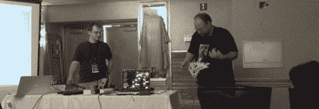

# Notacon 2008:电路弯曲介绍

> 原文：<https://hackaday.com/2008/04/06/notacon-2008-circuit-bending-intro/>

我们在 Notacon 参加的第一个讲座是[ [山姆·哈蒙](http://www.glacialcommunications.com/circuitbending.html) ]对[电路弯曲](http://en.wikipedia.org/wiki/Circuit_bending)的精彩介绍，这是一种修改发声电子设备以创造新乐器的过程。Reed Ghazala 因其始于 1966 年的开创性工作而被认为是电路弯曲之父。Sam 指出“[准备好的钢琴](http://en.wikipedia.org/wiki/Prepared_piano)”可以被认为是电路弯曲的非电前兆。它包括音乐家将不同类型的材料放在钢琴的部件上。Sam 展示了许多不同的电路弯曲开始的例子:卡西欧 PT-10[、](http://www.getlofi.com/?p=355) [PAiA Theremax](http://www.paia.com/theremax.asp) 、[雅达利朋克控制台](http://www.hackaday.com/2007/01/27/atari-punk-console/)。他还提到了几个 AVR 项目: [AVRSYN](http://www.jarek-synth.strona.pl/) 和 [todbot 的 Arduino 作品](http://todbot.com/blog/2006/10/29/spooky-arduino-projects-4-and-musical-arduino/)。

会议结束时，[Thom Robertson]展示了他制作的[奇怪的声音发生器](http://musicfromouterspace.com/analogsynth/YOUR_FIRST_SYNTH/WSG_Reborn/WEIRDSOUNDGENERATORREBORN.html)和他的[GHX 软件](http://music.eochu.com/)，用吉他英雄控制器播放真正的音乐。