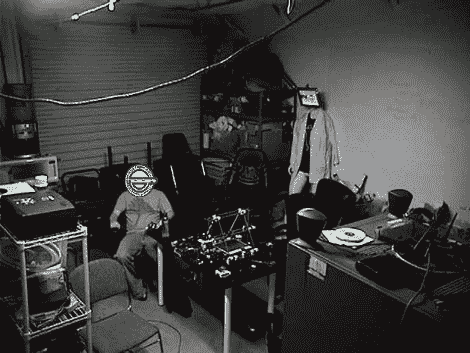

# 现在你看到我，现在你看不到，人脸检测脚本

> 原文：<https://hackaday.com/2010/06/27/now-you-see-me-now-you-dont-face-detection-scripts/>

这个笑着的男人直接出自《龟壳里的幽灵》，他出现在这些[安全摄像机镜头](http://www.abyssknight.com/2010/04/19/famicam-face-detection-twitter-and-you/)中。[William Riggins]写信给我们，让我们了解他的团队 [Famicam 脚本](http://github.com/abyssknight/famicam)。截屏后，人脸被检测和计数，“匿名化”，最终图像被上传到[推特](http://twitter.com/famduino)。

这个过程相当简单，而且肯定比穿着一堆白色反光迷彩服要好。剩下的工作就是检测*特定的*面孔来实现匿名，当然，还要将脚本上传到世界上的每一台摄像机。很简单，对吧？