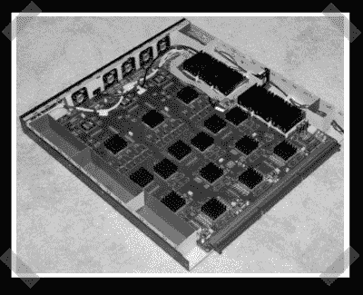

# NSA@home (DIY 共享 FPGA 破解程序)

> 原文：<https://hackaday.com/2007/08/31/nsahome-diy-shared-fpga-cracker/>

【云雀】将一对有缺陷的高清电视处理板改造成了他自己的 FPGA SHA-1 哈希破解程序。经过两个月的夜间工作，他最终获得了 15 个 Virtex-II Pro FPGA 和 5 个 Spartan-II FPGA 来完成他的投标。(FPGA 不便宜，所以这很棒)最终他会给它一个网络接口，允许根据请求破解提交的内容。棋盘上的伟大发现和奇妙的工作[云雀]。

*   [永久链接](http://nsa.unaligned.org/)