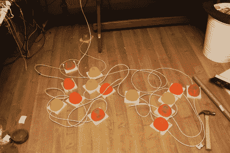

# 许多廉价的测验按钮

> 原文：<https://hackaday.com/2012/01/20/numerous-quiz-buttons-built-on-the-cheap/>

[Sprite_TM]被用来[构建一个相当大的问答蜂鸣器系统](http://spritesmods.com/?art=quizbtn&f=tw)。从他过去的工作来看，我们并不感到惊讶，他似乎没有困难满足要求。由于该系统不太可能被再次使用(或者即使被使用也很少)，他找到了一种既快速又便宜的方法来完成这个项目。

每个蜂鸣器由一个底座、一个按钮(机械的和电子的)和几个发光二极管组成，以指示谁先进入。按钮的机械部分使用宜家的一个塑料碗和一个木制销钉，周围有一些管道绝缘材料。一个瞬时按钮开关粘在那个销钉的顶部，绝缘材料稍微高出一点。这样它就像一个弹簧。定位销的尺寸应使碗唇在按下开关时能碰到木制底座。

如你所见，所有的蜂鸣器都是用以太网电缆连接的。这里真正的诀窍是如何只用一根 CAT5 电缆读取 14 个按钮。这是通过巧妙使用总共 16 个按钮的 4×4 按钮矩阵来实现的。矩阵还包括每个蜂鸣器的发光二极管。由于 CAT5 有四个双绞线，这工作得很完美。

寻找一个更强大的系统谢谢？这里有一个非常好的。