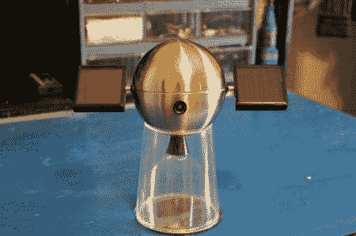

# 奥巴马一号桌面间谍卫星旨在获得高支持率

> 原文：<https://hackaday.com/2011/08/13/obama-1-desk-spy-satellite-aims-for-high-approval-ratings/>

这个微型[“间谍卫星”](http://www.instructables.com/id/Build-your-own-Spy-Satellite/)可能不会引起中国人民军队的愤怒，但它放在你的办公桌上肯定会很酷。除了看起来很酷之外，这颗“卫星”能够将视频传输到 300 英尺远的地方，并有太阳跟踪太阳能电池板为电池充电。此外，它还有一个 LED“推进器”和扬声器。

这个造型很酷的一点是它的主体是由 Goodwill 的灯做成的。回收/旧货店围栏总是为你的项目做一个很好的补充，因为它们不会打破银行。此外，他们可能会产生一些其他额外的部分时，拆开。在这种情况下，灯完全符合项目范围，但任何试图复制它的人可能就没那么幸运了。

其他家居材料的创造性使用完善了这个建筑，太阳能电池板从家庭花园灯上取下，鼻毛修剪器的一部分用作“推进器”身体。这个精心打造的项目是一个很好的例子，展示了如何将家居用品转变成完全不同且独一无二的东西。

[https://www.youtube.com/embed/pGqTmnSP71U?version=3&rel=1&showsearch=0&showinfo=1&iv_load_policy=1&fs=1&hl=en-US&autohide=2&wmode=transparent](https://www.youtube.com/embed/pGqTmnSP71U?version=3&rel=1&showsearch=0&showinfo=1&iv_load_policy=1&fs=1&hl=en-US&autohide=2&wmode=transparent)