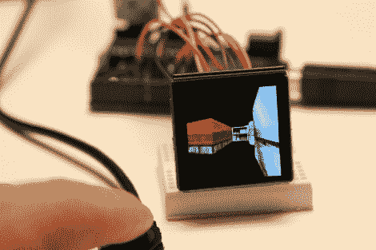

# 有机发光二极管显示器和小型微控制器

> 原文：<https://hackaday.com/2011/01/09/oled-displays-and-small-microcontrollers/>

如果你曾经想过在你的项目中使用一个小而便宜的有机发光二极管显示器，[Rossum]有你需要开始的细节。在过去，我们已经看到他带着[参观可用的液晶显示屏](http://hackaday.com/2010/10/14/touring-the-available-nokia-lcd-screens/)，这几乎是相同的，详细描述了他对三种不同型号的看法。在休息后的视频中，每个人都连接到他制作的驱动板。该板有两个重要组件，第一个是屏幕所需的 12-16V 输入的升压驱动器，第二个是使用 5V 微控制器时必需的八进制缓冲器。这些解决了硬件方面的问题，使得用您选择的芯片驱动它们变得很简单。

[https://www.youtube.com/embed/iHNqnbSxd6c?version=3&rel=1&showsearch=0&showinfo=1&iv_load_policy=1&fs=1&hl=en-US&autohide=2&wmode=transparent](https://www.youtube.com/embed/iHNqnbSxd6c?version=3&rel=1&showsearch=0&showinfo=1&iv_load_policy=1&fs=1&hl=en-US&autohide=2&wmode=transparent)