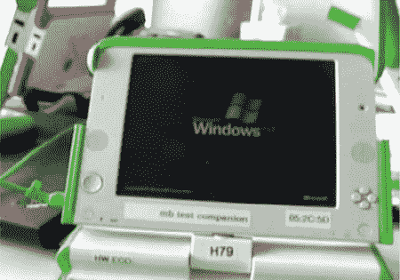

# OLPC 双引导

> 原文：<https://hackaday.com/2008/06/23/olpc-dual-booting/>

Gizmodo 有史以来第一个[OLPC 双启动镜头](http://gizmodo.com/5018780/first-footage-same-olpc-xo-boots-both-sugar-and-windows-xp)它的默认操作系统，Sugar Linux 和 Windows XP。BIOS 最初不是用来引导 XP 的，所以必须修改它才能工作。XO 的屏幕翻转和方向按钮在 XP 中也能工作。

不过，这也不全是好消息:XOs 被设计得非常精简，只有 256MB 的内存，这对于运行 XP 来说并不理想。光是启动它就花了很长时间，所以我们无法想象有人会用它做任何实际的事情。这些机器永远不会只安装 XP 系统。

*   [永久链接](http://gizmodo.com/5018780/first-footage-same-olpc-xo-boots-both-sugar-and-windows-xp)