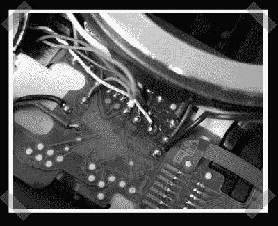

# 佳能数码相机 Rebel 的车载对焦确认

> 原文：<https://hackaday.com/2008/06/29/on-board-focus-confirmation-for-the-canon-digital-rebel/>

我们已经看到了很多镜头黑客，但是【Koray】把事情带到了[的新方向](http://www.instructables.com/id/Hack-Canon-EOS-300D-to-confirm-focus-with-all-lens/)。他没有购买镜头芯片来改装他所有的手动镜头，而是在他的数字反叛 300D(又名 ~~XT~~ )中添加了一个镜头芯片。我们中的大多数人可能会对挖出他们的反叛者感到畏缩，但他在一个他花 40 英镑买来并修复的装置上进行了这一点焊接手术。干得好！

更新:是啊是啊，300D 是原始的数字反叛。

*   [永久链接](http://www.instructables.com/id/Hack-Canon-EOS-300D-to-confirm-focus-with-all-lens/)