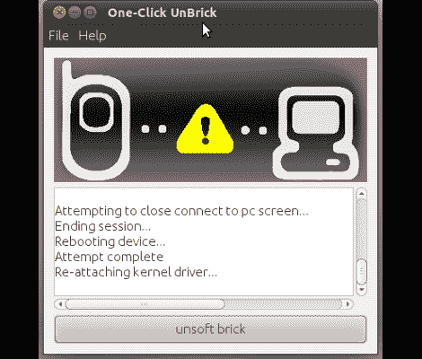

# 三星手机一键解锁

> 原文：<https://hackaday.com/2011/07/12/one-click-unbrick-for-samsung-phones/>

[Adam Outler]最近非常热衷于移动设备黑客攻击。这一领域最大的问题是从回闪或开发固件故障中恢复。在许多情况下，你可以使用 JTAG 程序员刷新股票固件复活手机。不幸的是，你很难找到一部带有 JTAG 插头的手机，而且焊接到微电子板上也不适合心脏虚弱的人。

但是这里有一个解决方案，[Adam]汇集了广泛的资源，创建了一个软件包来解除三星手机的捆绑。现在，我们可以肯定，有很多人会认为，一个坏的固件闪存可以通过这种方式修复，这意味着手机实际上并没有在第一时间被“阻止”。但我们看到的是成为硬件用户和成为硬件黑客之间的又一个障碍被拆除了。如果你知道你将能够撤销你的错误并收回你宝贵的袖珍硬件，你更有可能进去弄脏你的手。休息过后，看看视频中有多简单。

[https://www.youtube.com/embed/tEotRhChSE4?version=3&rel=1&showsearch=0&showinfo=1&iv_load_policy=1&fs=1&hl=en-US&autohide=2&wmode=transparent](https://www.youtube.com/embed/tEotRhChSE4?version=3&rel=1&showsearch=0&showinfo=1&iv_load_policy=1&fs=1&hl=en-US&autohide=2&wmode=transparent)