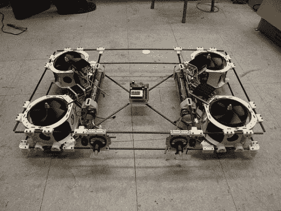

# 一架非常大的四轴飞行器正跟随云杉鹅的脚步

> 原文：<https://hackaday.com/2011/07/19/one-really-big-quadcopter-that-is-following-in-the-steps-of-the-spruce-goose/>

看看陆地熊鲨，一种规模相当大的四轴飞行器。足足八公斤的重量很容易与[霍华德·休斯]这个庞然大物相比较，但除了重量之外，它还没有进行首次飞行。

为了让你对上图有所了解，中间的板子是一个 Arduino。它在顶部的 SparkFun IMU 板的帮助下控制野兽。真的，如果这种大小的四轴飞行器有工作的机会，这应该是一个。这种结构很漂亮，利用碳纤维杆和 3D 打印的连接器来组装框架。很多想法都集中在一些小事情上，比如节省起落架的重量，这些都包含在底部的角支架中。电池以一种易于调整的方式连接，充当平衡船只的压舱物。

我们祈祷这不仅仅是帖子中开玩笑的标题，称之为四旋翼飞行器形状的雕塑。

[途径 [Adafruit](http://www.adafruit.com/blog/2011/07/17/this-is-going-to-be-the-biggest-quadcopter-ever/)