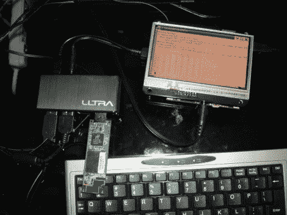

# 开放式图形计算器:Beagleboard + R

> 原文：<https://hackaday.com/2010/08/06/open-graphing-calculator-beagleboard-r/>

看起来我们在这一点上错过了机会，但是如果你在互联网上的其他地方错过了它，上周六[Matt Stack] [向世界介绍了一个完全开源的计算器](http://antipastohw.blogspot.com/2010/07/introducing-100-open-source-hwsw-r.html)。这结合了两个经过充分测试的开源项目；用于统计计算的 [R 项目](http://www.r-project.org/)和 [Beagleboard](http://beagleboard.org/) 。硬件方面的事情与六月份发布的 Linux 平板电脑非常相似。它使用带有 BeagleTouch 模块的股票 Beagleboard。

我们为什么关心？首先，不要忘记引擎盖下是什么。该 ARM 处理器将 TI 计算器中的 6 MHz Z80 处理器踢到了路边。R 语言也是一个福音，它提供了几乎无限的质量，并允许可扩展性，这是当前非开放产品所不能比拟的。但主要是因为它是个黑客。我们喜欢看到[软件在硬件上运行，它不是为](http://hackaday.com/2009/06/16/dell-vostro-a90-hackintosh/)设计的。