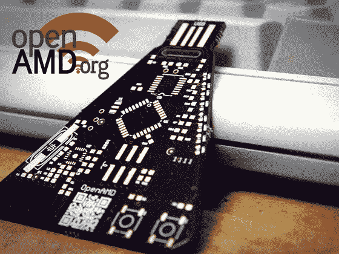

# 开放黑客大会徽章项目需要你的帮助！

> 原文：<https://hackaday.com/2011/04/18/open-hacker-conference-badge-project-needs-your-help/>

[Aestetix]来信告诉我们， [OpenAMD](http://openamd.org) (与会者元数据)项目正在开发他们硬件的新版本，将于今年秋天在 CCC Camp 首次亮相。

对于外行人来说，OpenAMD 结合了主动 RFID 跟踪系统和社交网络，并且是完全开源的。你走进会议，戴上 OpenAMD 的徽章，突然你可以看到自己是一个在地图上移动的点。或者，你可以登录社交网站，创建一个个人资料，然后观看你的个人信息被拉入网格，然后告诉你你可能喜欢的谈话，你可能喜欢的人，那些人在哪里，等等。甚至有一个开放的 API，你可以创建自己的“杀手级”应用，其中可能包括游戏或其他有趣的与会者信息集合。

今年的“erlenmeyer flask”徽章是这个项目的最新化身，你可能已经在 2008 年和 2010 年的 2600 黑客地球会议上，或者在 2006 年或 2007 年的混沌计算机大会(CCC)上看到过。这一次，该团队希望在今年夏天的 CCC 夏令营中部署，并在未来的许多会议上部署(待定)。

徽章本身是一个 Atmega AVR 微控制器，连接到一个 Nordic nRF24L01+和一对 74HC595 移位寄存器。AVR 运行的是 [USBaspLoader](http://www.obdev.at/products/vusb/usbasploader.html) ，上面有定制的 OpenAMD 固件，它与 Nordic 芯片共同实现了 [OpenBeacon](http://www.openbeacon.org/) air 协议。移位寄存器驱动 14 个发光二极管，这些发光二极管能够用作视觉暂留显示。因为有了 USBaspLoader，你甚至不需要 Atmega 在线程序员来刷新芯片:你甚至可以使用 [Arduino](http://hackaday.com/tag/arduino/) IDE 来实现你自己的功能。

徽章、“阅读器”、创建你自己的实例所需的所有硬件和软件都是完全开源的，你今天就可以下载规格*和*并对它们进行修改。

那么有什么问题呢？他们需要你的帮助。他们正在运行一个 [kickstarter](http://www.kickstarter.com/projects/1742965716/openamd-open-source-location-tracking-and-social-n) 来筹集制作这些徽章所需的最低金额，并将它们带到 CCC 营地，你可以提供的任何支持都将大有帮助。即使你不去 CCC 营地，他们也计划在未来更多的州级会议上部署，徽章本身也足够有趣。北欧的芯片可[特别好玩](http://goodfet.sourceforge.net/clients/goodfet.nrf/)。

这里有一个简短的视频，解释了去年在 TNH 安装的整个过程:

[https://player.vimeo.com/video/12032834](https://player.vimeo.com/video/12032834)

完全公开？这次我在设计徽章硬件。