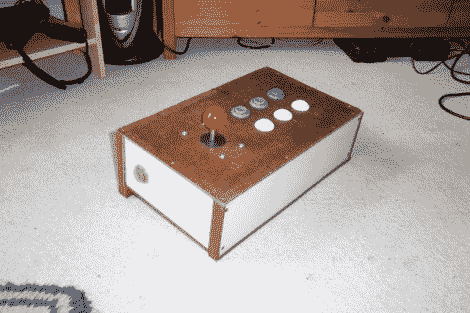

# 开源使这款 USB 街机控制器变得轻而易举

> 原文：<https://hackaday.com/2011/10/05/open-source-makes-this-usb-arcade-controller-build-a-breeze/>

[杰米]建立了自己的 [USB 连接的街机控制器](http://jamie.lentin.co.uk/embedded/arcade-joystick/)。我们最近已经看到很多这样的例子，它们通常涉及[将按钮焊接到键盘 PCB](http://hackaday.com/2011/09/27/turn-your-wireless-keyboard-into-a-mame-controller/) 。但是[杰米]决定走一条不同的路线，使用他自己的微控制器。在决定如何将其连接到计算机时，这种方法总是有点棘手。处理 USB 堆栈曾经相当棘手，但 LUFA 项目正在慢慢消除这一过程中的痛苦。

AVR 的轻量级 USB 框架是一个开源项目，处理与支持 USB 的 AVR 微控制器相关的繁重工作。[Jamie]知道他们已经有了硬件操纵杆的样本实现[。他没有使用受支持的板，所以不能编译和运行。但是将代码移植到他的 minimus 板上非常简单。有了代码，物理构建就相当简单了。按钮和操纵杆安装在一个翻转的抽屉表面。每个都连接到控制板的一个引脚和地。LUFA 确保这个设备是一个游戏杆，然后[杰米]马上开始玩游戏。](http://www.fourwalledcubicle.com/files/LUFA/Doc/110528/html/group___group___joystick.html)