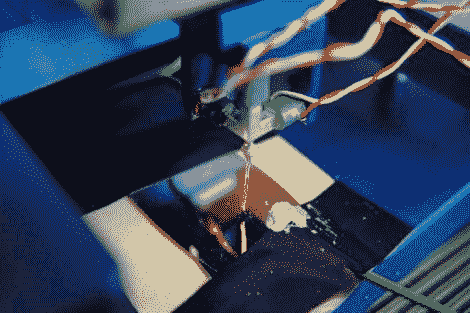

# 开源 STM

> 原文：<https://hackaday.com/2010/05/22/open-source-stm/>

我们希望你在高级理论和量子物理课上有所关注，或者制作你自己的开源[扫描隧道显微镜](http://sxm4.uni-muenster.de/introduction-en.html)可能有点疯狂。我们甚至不打算开始解释这个装置(老实说，我们整个课程都在睡觉),除了澄清它是用来检查表面的分子和原子结构；但是对于那些仍然感兴趣的人来说，这里有一个关于[扫描隧道显微镜如何工作的很好的分析。](http://www.fkp.uni-erlangen.de/methoden/stmtutor/stmpage.html)

[谢谢里奇]