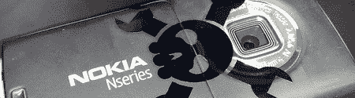

# 开源 Symbian

> 原文：<https://hackaday.com/2008/06/24/open-source-symbian/>

诺基亚最近宣布了其[收购塞班](http://ostatic.com/166030-blog/symbian-to-go-open-source-nokia-to-buy-out-symbian-shares)的计划，并成立了[塞班基金会](http://www.symbianfoundation.org/)，意图在未来两年内开放软件平台。Symbian 已经出现在世界上 60%的手机上。有了如此庞大的安装基础，开源 Symbian 比像 Android 这样的平台有更好的机会起飞，Android 是从底层开始的。

*   [永久链接](http://ostatic.com/166030-blog/symbian-to-go-open-source-nokia-to-buy-out-symbian-shares)