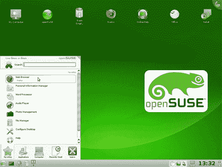

# OpenSUSE 11.0 已审核

> 原文：<https://hackaday.com/2008/06/19/opensuse-110-reviewed/>

下载小队已经贴出[对 OpenSUSE 11.0](http://www.downloadsquad.com/2008/06/19/opensuse-11-0-review-part-3/) 的彻底审查。以前版本的 Linux 发行版被棘手和混乱的安装所困扰，但是 [OpenSUSE 11.0](http://news.opensuse.org/2008/06/19/announcing-opensuse-110-gm/) 安装起来更加容易和干净。在几个标准配置屏幕之后，用户有几个管理帐户、磁盘分区、双引导设置等选项。操作系统文件的安装大约需要 20 分钟，然后是快速重启和第一次引导，这使得从开始到结束的安装高度可定制且快速。

以前版本的另一个主要问题是他们的包处理系统速度不一致。然而，在 11.0 中，一个名为 [Zypper](http://en.opensuse.org/Zypper) 的新命令行应用程序使得安装更新、补丁和其他软件包的速度更快。

最终的结论是，OpenSUSE 11.0 已经成为 Ubuntu 的可行替代方案；开源发行版的整体质量从未受到质疑，但现在速度已经从它最大的不足变成了它最大的优势之一，我们期待在野外看到更多的变色龙。

*   [永久链接](http://www.downloadsquad.com/2008/06/19/opensuse-11-0-review-part-3/)