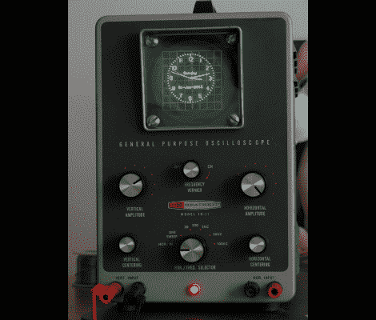

# 垃圾箱搜寻使示波器时钟成为可能

> 原文：<https://hackaday.com/2012/01/12/oscilloscope-clock-made-possible-by-dumpster-diving/>

我们看到人们在收集垃圾的前一天晚上开车四处转悠，回收注定要填埋的物品(或者在回收的路上……谁知道呢)。我们开始认为我们需要加入这些行列。恰当的例子是这个老式示波器，它是鲍勃·亚历山大在紧要关头从路边捡出来的。更糟糕的是，当他把它带回家时，他发现它还能用！他不能让这个机会白白浪费，所以他想出了如何[把它变成一个时钟，而又不失去把它用作瞄准镜](http://galacticstudios.org/component/content/article/2-electronics/30-oscilloscopeclock)的能力。

你可能已经知道在示波器上显示你自己的图形是可能的。事实上，你可以从 Sparkfun 购买一块电路板，它会把示波器变成一个模拟时钟，这正是[Bob]所做的。但是他遇到了两个问题，X 轴翻转了，他没有简单的方法给电路板供电。

他与电源电压进行了斗争，他第一次尝试将内部 6.3V 电源升压，以与线性 5V 调节器配合使用。他的第二次尝试成功了，将 12V 稳压器焊接到变压器上。然后，他开始进行 X 轴校正，使用轨到轨运算放大器来反转信号。该项目通过在表壳背面添加切换控件和按钮来完成，以在示波器和时钟模式之间切换，并设置时间。