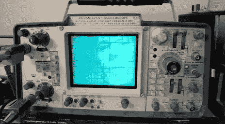

# 示波器认为它是一个视频监视器

> 原文：<https://hackaday.com/2011/03/30/oscilloscope-thinks-its-a-video-monitor/>

你的电视机没有毛病。不要试图调整画面。

如果我们听了这样的建议，我们会怎么样呢？[Eric]写道，通过一个相当简单的电路，他能够[将一个复合视频信号分离成其组成部分 X 和 Y 斜坡信号](http://tubetime.us/?p=96)，以在他值得信赖的 Tektronix 465m 上显示。LM1881 IC 完成了大部分繁重的工作。在将信号通过一些无源元件后，产生的斜坡信号就可以被他古老的示波器使用了。除此之外，还需要一些额外的粘合逻辑来反转层次，这样图像才能正确显示。最终的结果是一个显示器，它有一个几乎缥缈的质量，就像一台旧电视机或电影 *[巴西](http://www.imdb.com/title/tt0088846/)中的东西。*

点击休息，观看赛道运行视频。

[https://www.youtube.com/embed/-FK7hy5usYE?version=3&rel=1&showsearch=0&showinfo=1&iv_load_policy=1&fs=1&hl=en-US&autohide=2&wmode=transparent](https://www.youtube.com/embed/-FK7hy5usYE?version=3&rel=1&showsearch=0&showinfo=1&iv_load_policy=1&fs=1&hl=en-US&autohide=2&wmode=transparent)