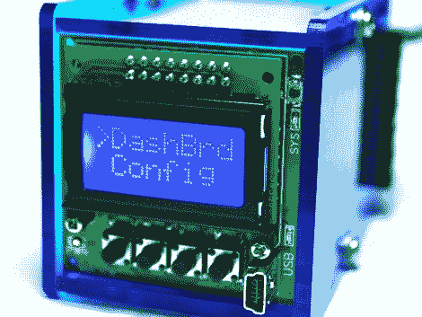

# OsPID:开源 PID 控制器

> 原文：<https://hackaday.com/2012/01/05/ospid-the-open-source-pid-controller/>

Need PID control in your next project? Perhaps this little beauty can help. It’s [an Open Source PID controller that also follows the Open Hardware guidelines](http://www.ospid.com/blog/initial-release-is-finally-here/). [Brett Beauregard] based the project on the [newly minted Arduino PID library](http://hackaday.com/2011/07/21/demystifying-pid-control-with-a-look-at-the-new-arduino-pid-library/) which he wrote. In the video after the break [Brett] takes apart the device, walking through some of the ways this might be hacked. If you want an overview of every part of this project to-date the best resource is probably [his personal blog post](http://brettbeauregard.com/blog/2012/01/introducing-the-ospid/).The front circuit board is the meat and potatoes of the device. It hosts the user interface in the form of buttons, LEDs, and a graphic LCD screen. You can also see the USB mini-b connector which gives you access to the Arduino compatible ATmega328 microcontroller on the back. There is also a piezo buzzer for your alarm needs.The prototype that [Brett] shows off uses pin connectors to join the main board to the two daughter boards. Unfortunately, the production model moved to dual-sided edge connectors. That’s fine if you you’re using it in its stock condition, but it makes it a bit harder to replace those boards with your own hardware. None-the-less, we love to see great Open Hardware projects brought to market