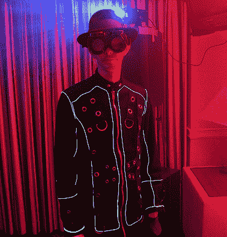

# 现已上市:EL 外套，即将上市:EL 帽子

> 原文：<https://hackaday.com/2010/08/10/out-now-el-coat-coming-soon-el-hat/>

[Render]说[他的外套](http://www.renderlab.net/projects/ELcoat/)简直是“用 EL 线增强的”，但我们知道真相。他是一个秘密的外星人，不能用黑色的外套挡住他所有发光的绿色皮肤。没有吗？好吧，

你可以把缝纫机收起来，[Render]简单地用一根针和一根钓鱼线把大约 50-70 英尺长的电致发光线连接到他在当地服装店买的一件外套外面。感谢 SparkFun ，在逆变器和[控制器板上焊接和编程，你就可以开始了。](http://www.sparkfun.com/commerce/product_info.php?products_id=9203)

只是仔细检查你所有的连接，高压直接对你的人是不好玩的。[信任我们](http://hackaday.com/2010/01/09/ces-caleb-gets-tased/)