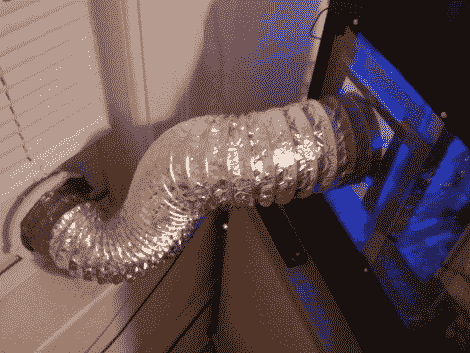
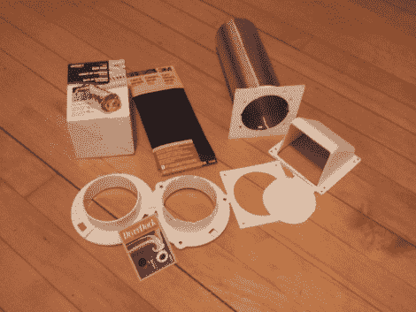
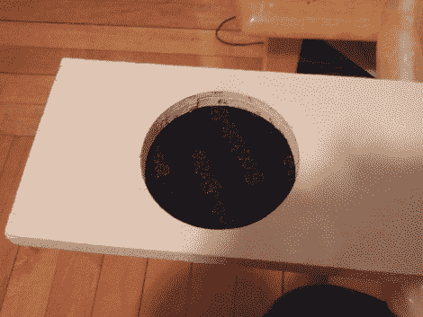
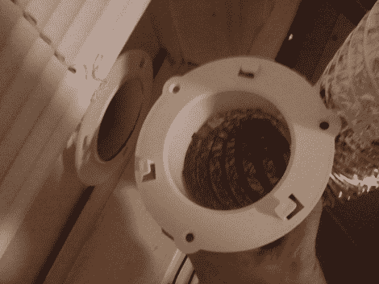

# 外部空气冷却的电脑

> 原文：<https://hackaday.com/2011/01/10/outside-air-cooled-pc/>

[Brian]提出了一个有趣的电脑冷却设置。他住在北方，那里冬天很冷。使用一点干燥管道，他能够利用外部空气来冷却他的盒子。该系统使用一个窗口插件和一个干燥罩，通过电脑风扇吸入外部空气。我们希望空气被充分加热，因为它被排放到室内。休息后加入我们，看更多他的照片。

下面是他使用的管道配件。这包括一个外面的罩，一个依靠重力关闭的阻尼器，一些作为过滤器的 scotch brite 垫，一个柔性导管和一个快速接头。

接下来的三个图像显示了窗插件的构造。过滤器和遮光罩在电路板的外部，快速连接在内部。虽然[Brian]在他的零件图像中显示了一个阻尼器，但我们不确定它实际安装在哪里。我们认为这种阻尼器最好有一个伺服致动器，因为重力不足以阻止风迫使它打开。

