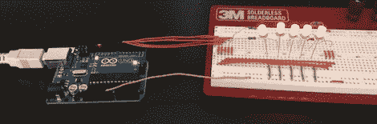

# 过度构建 ITunes 评级系统

> 原文：<https://hackaday.com/2012/02/25/overbuilding-an-itunes-rating-system/>

尽管 iTunes 和它的歌曲评级系统已经存在了十多年，但[史蒂夫]仍然没有给自己庞大的 MP3 库打分。我们不能责怪他——谁愿意每四分钟打开 iTunes，给每首歌单独打分呢？为了解决这个接口问题，[Steve]着手设计了一个[硬件歌曲评级接口](http://www.macdweller.org/2012/02/24/ratings-rabbit-holes/)，这个接口掉进了开发地狱的兔子洞。

构建开始时非常简单——只是一个 Arduino 连接到几个按钮，将数据发送到 Cocoa 应用程序，该应用程序对当前歌曲进行评级。在[史蒂夫]重启他的 mac 电脑，通讯端口失灵之前，一切都运行得很好。想要一个“即插即用”的解决方案，他放弃了基于 Arduino 的构建，开始设计一个 USB 设备，该设备将显示当前的 iTunes 曲目，并提供为当前歌曲评级的硬件按钮。

当前的构建基于一个非常强大的 PIC 18F4550 微处理器。在查找了 USB [HID 协议](http://www.macdweller.org/2012/02/24/ratings-rabbit-holes/5/)之后，【Steve】制作了一些电路板。他让我们等待最终的构建报告，但是考虑到这个项目的工作量，我们确信它会是一个赢家。