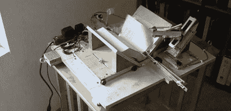

# 翻页式图书扫描仪综述

> 原文：<https://hackaday.com/2011/10/02/page-turning-book-scanner-roundup/>

[丹尼尔]在 diybookscanner.org[发布了迄今为止最好的自动图书扫描仪的综述](http://www.diybookscanner.org/news/?p=265)。[Spork]用“没有自动翻页=没有用”总结了我们对[上一期书籍扫描仪](http://hackaday.com/2011/07/18/diy-book-scanner-processes-600-pageshour/)报道的很多评论不过，用机器人翻书真的很难*，而且这些构建在自动化非常繁琐的工作方面做得非常惊人。*

 *首先是【jck57】的[伺服驱动自动扫描仪](http://diybookscanner.org/forum/viewtopic.php?f=1&t=1180)。从视频来看，这个版本非常好，我们发现它只跳过了一页。请看视频[的行动](http://www.youtube.com/watch?v=PVLhrdcII_A)和[的概述](http://www.youtube.com/watch?v=f5H-8QqkGSA)。

接下来是柏林黑客空间 c-base 的[真空盒](http://diybookscanner.org/forum/viewtopic.php?f=1&t=588&hilit=slot)扫描仪。[视频](http://www.youtube.com/watch?v=65ViHOGyOv8)展示了一个巨大的菱形盒子，盒子顶部连接着一根真空吸尘器软管。盒子被压入书的装订处，在那里真空吸起下一页。这是[这种非常昂贵的机器](http://www.youtube.com/watch?v=y16rNqnxj0U)的手动版本，但有一个好处，就是不用机器人机械手戳一本有几个世纪历史的书。

[dtic]是最早研究自动翻页的人之一。他的[原型](http://www.diybookscanner.org/forum/viewtopic.php?f=1&t=379&start=30)(此处[视频](http://www.youtube.com/watch?v=_SBF51g3X7I))使用伺服系统，但结构非常简单。缺点是书一次只能扫描书的一面；为了得到另一面，用户必须把书翻过来再扫描一遍。

[加多项目](http://www.kickstarter.com/projects/1889549817/project-gado-an-open-source-photo-digitization-rob?ref=live)是一个不成功的 Kickstarter 活动，其目标是开发一种扫描仪来存档约翰·霍普金斯大学的照片。该建筑使用真空吸盘将页面提升到平板扫描仪上。它比其他版本慢很多，但我们认为跳过一页的风险会更小。

至于处理数码相机拍摄的图像，【Steve】的[图书扫描向导](http://www.diybookscanner.org/forum/viewtopic.php?f=9&t=785)处理大量必要的后处理任务。通过[史蒂夫]的应用程序，可以将所有内容转换为 PDF 格式，更改 DPI，并整理所有页面。[下载这里](http://sourceforge.net/projects/bookscanwizard/)。

翻页是一个非常困难的问题——书是为手设计的，而不是为夹子设计的。如果你有一台想要炫耀的图书扫描仪，[在提示行](http://hackaday.com/contact-hack-a-day/)发送它。我们一定会把它放上去。*